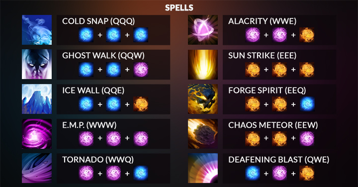

# Invoke
A simple game to practice Invoker spells from Dota 2.

# Game rules
You need to cast every spell shown until it reaches the bottom of the screen! If you cast the wrong spell (not presented on the screen) or if the spell reaches the bottom the game is over.

# FAQ
Nobody ever asked these.

## How to play? I have never played Dota 2 but somehow ended up here.
If you have never played Dota 2 just ignore this game then, there is no fun in playing it without the Dota aspect. But in case you are still interested in trying it out, here is an explanation on how to play.

You have 3 orbs that you can cast: Quas, Wex and Exort (default keys for casting an orb are Q,W,E respectively)

| Quas                            | Wex                           | Exort                             |
|---------------------------------|-------------------------------|-----------------------------------|
|  |  |  |

A spell is an unordered combination of 3 orbs. To cast a spell, you need to cast the 3 orbs that correspond to the spell and press the `Invoke` key (by default: R).

Here is the list of all possible spells


So to cast `Cold Snap` you would need to cast 3 `Quas` orbs (hitting Q 3 times by default) and `Invoke` (R by default). Casting 1 correct spell will give you 1 point.
## Will this game make a better Dota 2 / Invoker player?
Not really. I don't think that playing any hero in Dota 2 is about casting spells, but having that extra efficiency will give you an edge over other players.

I do believe though that the PRO mode (which is not implemented yet :skull:) can be very beneficial and will give you a lot of confidence and speed in casting spells.
## Can I use custom keybindings?
Yes. Unfortunately at the moment only by editing the `settings.toml` file which is located here:

``` sh
# On Windows
C:\Users\{user_name}\AppData\Roaming\invoke\settings.toml

# On Linux
/home/{user_name}/.config/invoke/settings.toml
```
## Will my highscore be tracked somewhere?
No. If enough people will play this game (at least 2, including me) I will add local highscore tracking.
# Installation
At the moment the only way to install this game is to clone the repo and do a `cargo run` or build it and move use the binary. To run:

``` sh
git clone https://github.com/pophilpo/invoke.git
cd invoke
cargo run
```

To build:
``` sh
# This will create a binary in invoke/target/release/invoke
git clone https://github.com/pophilpo/invoke.git
cd invoke
cargo build --release
```
# Project status

- [x] Default game mode
- [x] Custom keybindings
- [ ] PRO mode
- [ ] Changing settings in-game
- [ ] Immortal spell icons
- [ ] Dynamic image scale (background/spells/orbs)
- [ ] Storing highscore
- [ ] Global Leaderboard
- [ ] Custom wallpaper
